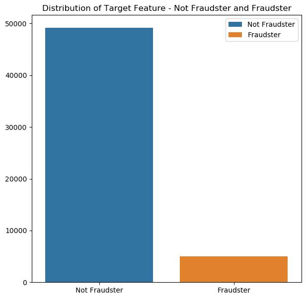
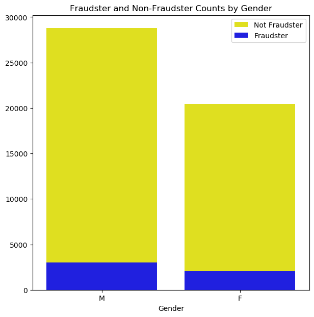
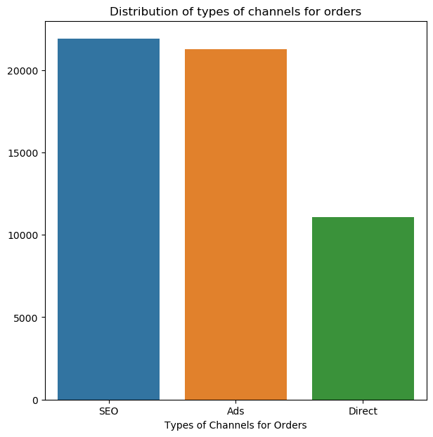
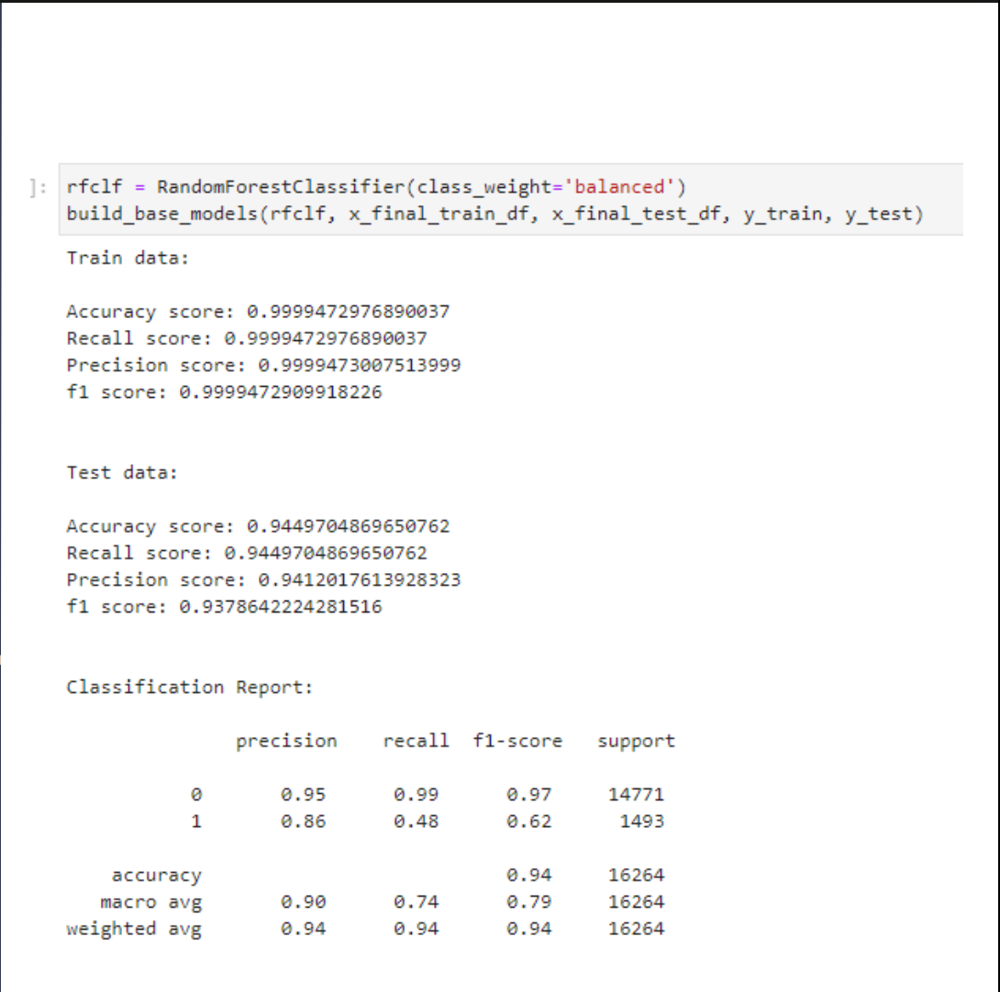
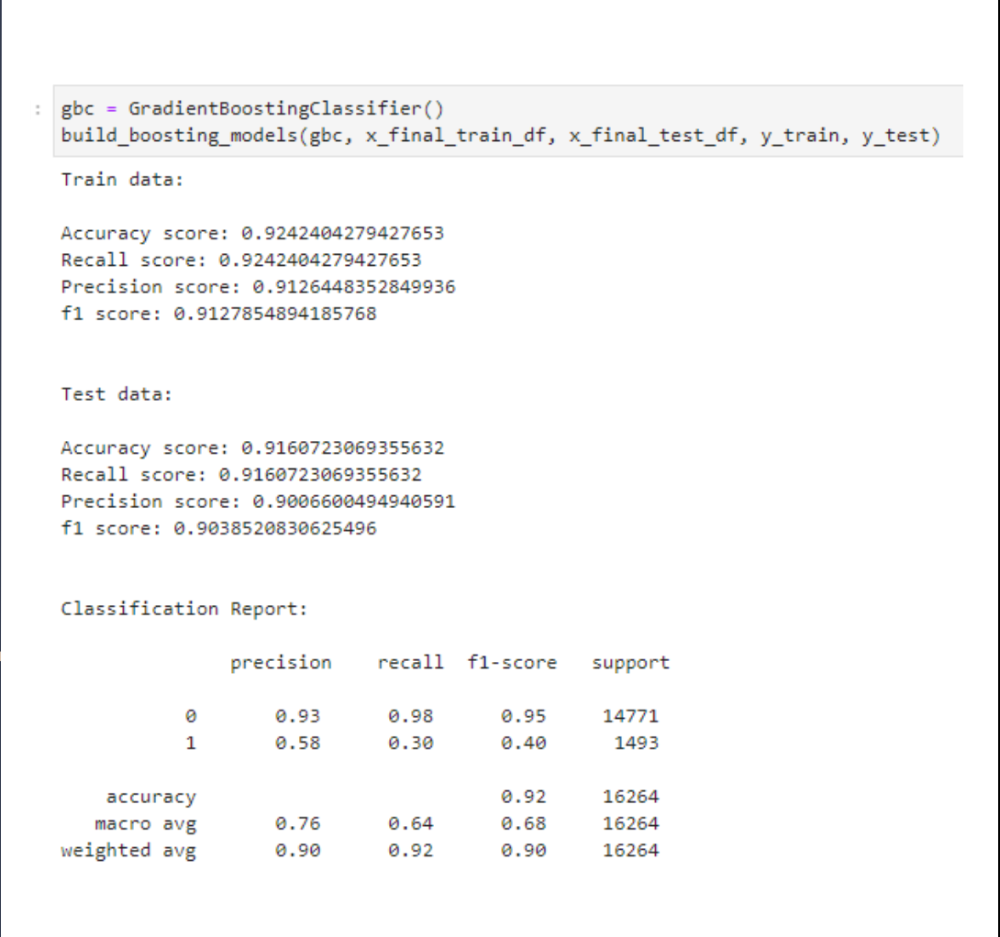
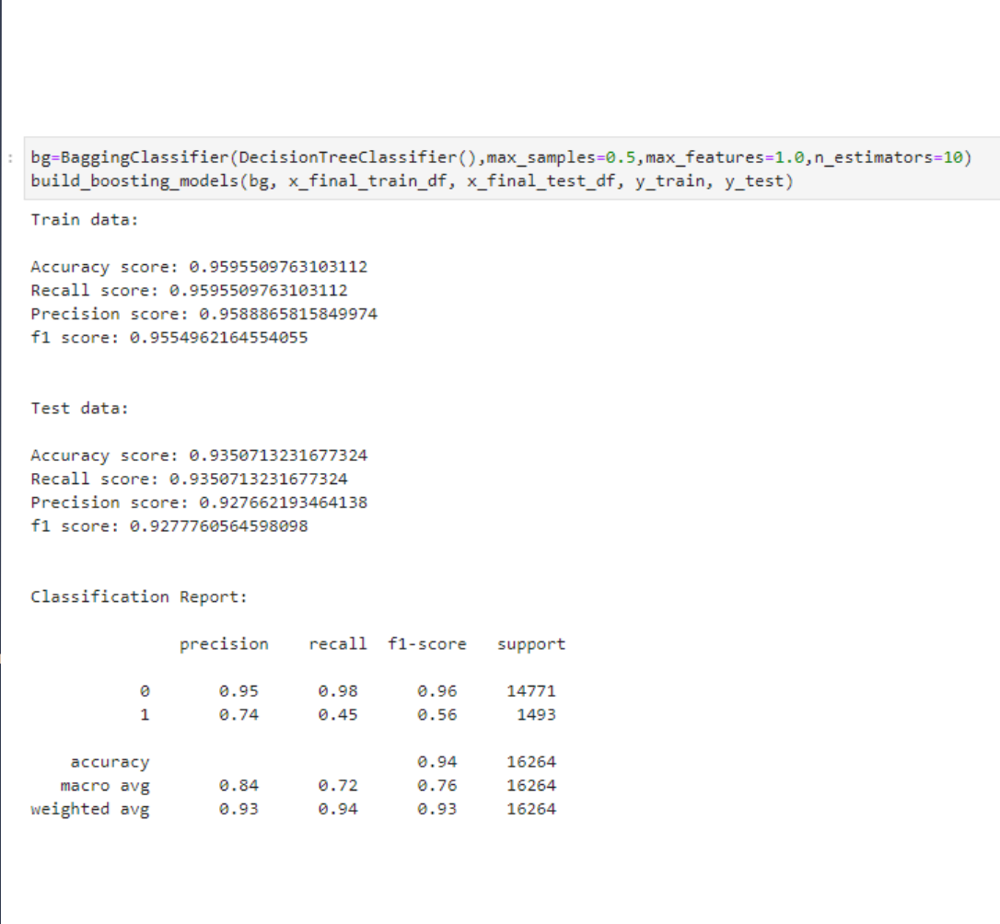
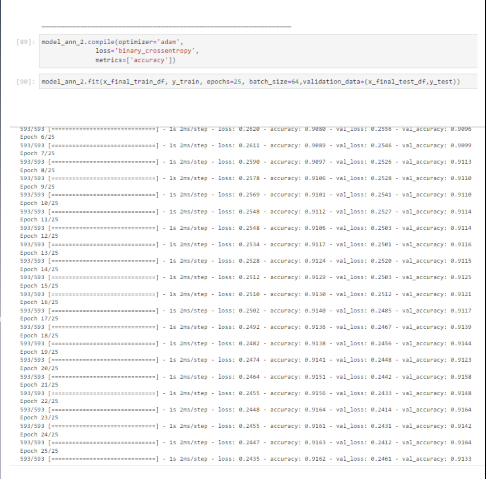
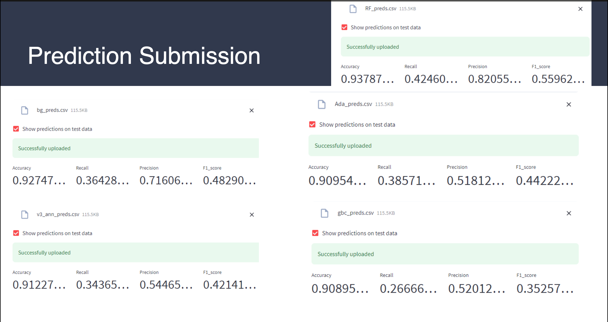

# Merchant Fraud Detection using Machine Learning

## Overview
This project aims to detect merchant fraudulency based on the quantitative and qualitative features provided in the datasets. The goal is to build predictive models using machine learning techniques to classify merchants as fraudulent or legitimate.

## Exploratory Data Analysis (EDA)

### Train Data
- `train_merchant_data.csv`: Merchant Information
- `train_order_data.csv`: Order Information
- `train.csv`: Target Label Information

### Test Data
- `test_merchant_data.csv`: Merchant Information
- `test_order_data.csv`: Order Information
- `test.csv`: Target is not available as it is to be predicted

Additionally:
- `ip_boundaries_countries.csv`: IP addresses boundaries for each country (common for both train and test)

## Methodology
**Data Collection**: Merged the three CSV files (merchant data, order data, and target labels) into dataframes for both train and test datasets.
**Feature Engineering**: Engineered new features and processed existing ones to extract relevant information.
 

## Model Creation and Evaluation

### Random Forest
- **Description**: Random Forest is an ensemble learning method that constructs a multitude of decision trees at training time and outputs the class that is the mode of the classes (classification) or mean prediction (regression) of the individual trees.
  

### AdaBoost
- **Description**: AdaBoost (Adaptive Boosting) is an ensemble learning method that combines multiple weak classifiers to build a strong classifier. Each classifier is trained on the misclassified data from the previous classifiers.
  

### Gradient Boosting
- **Description**: Gradient Boosting is a machine learning technique for regression and classification problems, which produces a prediction model in the form of an ensemble of weak prediction models, typically decision trees.
  

### Bagging
- **Description**: Bagging (Bootstrap Aggregating) is an ensemble learning technique that involves training multiple models in parallel on different subsets of the training data and then combining their predictions.
  

### Artificial Neural Networks (ANN)
- **Description**: Artificial Neural Networks are computing systems inspired by the biological neural networks of animal brains. They learn to perform tasks by considering examples, generally without being programmed with task-specific rules.
  

## Final Prediction
The best-performing model was used to make predictions on the test dataset.

## Conclusion
This project demonstrated the effectiveness of various machine learning algorithms in detecting fraudulent merchants in an e-commerce platform. By leveraging feature engineering and model evaluation techniques, we were able to build a robust fraud detection system.

## Future Work
1. Further fine-tuning of models to improve performance.
2. Implementation of real-time monitoring for continuous fraud detection.
3. Integration of additional features and external data sources for enhanced predictive power.

## Contributors
- [Apoorva Agarwal](https://github.com/Apoorva-Agarwal)
